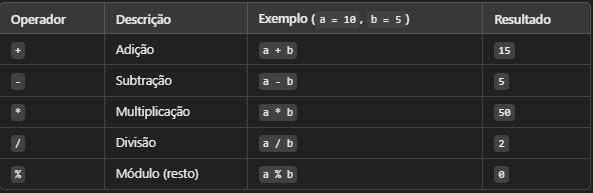
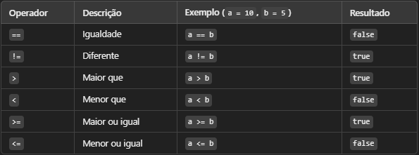
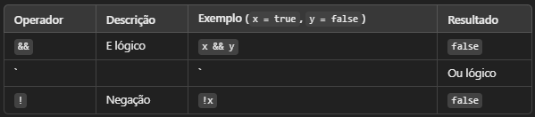

# Operadores Aritméticos, Lógicos e Relacionais em Java

Os operadores são símbolos especiais usados para manipular variáveis e valores. Eles podem ser usados para: 

- Realizar cálculos matemáticos (adição, subtração, multiplicação, etc.)

- Comparar valores para tomada de decisões.

- Avaliar expressões lógicas (Verdadeiro ou Falso)

## Conceitos Fundamentais

- Operadores Aritméticos: são operadores matemáticos que são usados para fazer calculos matemáticos.

- Operadores Relacionais: São usados para comparar valores e retornam **true** ou **false**.

- Operadores Lógicos

Usados para combinar expressões booleanas (**true** ou **false**)

