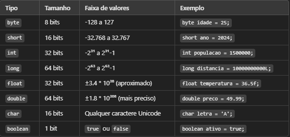

# Tipos de Dados em Java

Os tipos de dados determinam o tipo de valores que podem ser armazenados em variáveis. Java possui dois grupos principais:

**Tipos primitivos** → Armazenam valores simples diretamente na memória.

**Tipos de referência** → Armazenam referências para objetos, permitindo manipular estruturas mais complexas.

## Tipos Primitivos

Os tipos primitivos são os blocos básicos de construção do Java. Eles ocupam um espaço fixo na memória e são mais rápidos.

- **long** deve terminar com **L**, como em **1000000L**.

- **float** deve terminar com **f**, como em **3.14f**.

- **char** usa aspas simples (**'A'**), enquanto String usa aspas duplas (**"Java"**).

## Tipos Referência (Armazenam objetos e arrays)

Os tipos de referência armazenam endereços de memória que apontam para objetos. Diferente dos primitivos, eles não armazenam diretamente o valor, mas sim uma referência ao objeto.

